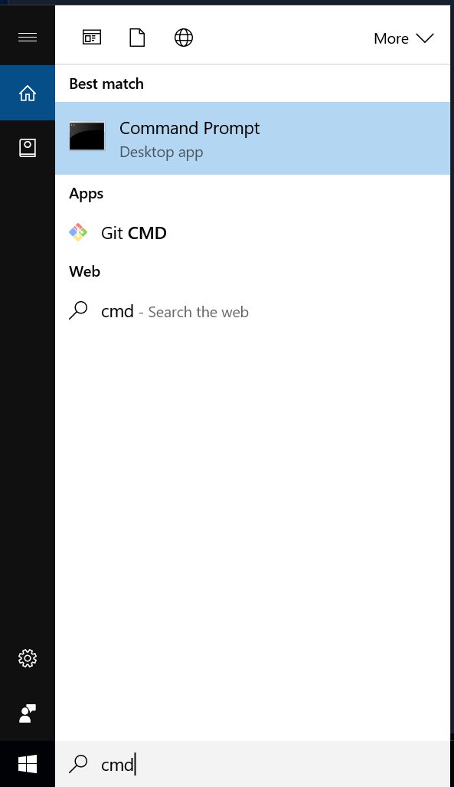

# Windows Setup
The workshop requires the following:
1. Use of a `shell`, the `Command Prompt` will do,
2. Java JDK (Java Development Kit) installed,
3. The Scala example project (doodle)

## Windows Shell
1. Press the `Windows` key and the `E` key together to open a Windows Explorer window with `Computer` selected.
2. Right click on `Computer` (`This PC` in Windows 10) and select `Properties` from the context menu. This opens the System Control Panel window. Find the `System type:` field and note whether your computer is running 64-bit or 32-bit Windows.
3. Close the System Control Panel window.
4. Return to the Windows Explorer window. It should show `Computer` in the Address Bar toward the top of the window:


5. To complete the rest of the instructions, open the Windows Command Prompt app. In Windows 10, you can launch it by clicking the text box on the bottom left corner of your screen and typing `cmd` and enter:



6. You will then see a window that looks something like this:


## Java JDK Installation

To begin, type: `java -version` at the prompt. If you have Java installed you should get a response like:

```
C:\Users\Tim>java -version
java version "1.8.0_101"
Java(TM) SE Runtime Environment (build 1.8.0_101-b13)
Java HotSpot(TM) 64-Bit Server VM (build 25.101-b13, mixed mode)

C:\Users\Tim>
```

If your Java version is 1.6 or higher, then you can skip the Java JDK Installation section below.

1. Download the JDK installer for Windows from [Oracle](http://www.oracle.com/technetwork/java/javase/downloads/index.html). If your computer is running 32-bit Windows download the `x86` version, if it is running 64-bit Windows download the `x64` version.
2. Run the installer
3. Add the `bin\` directory of the installed JDK to the PATH environment variable, as described [here](http://www.java.com/en/download/help/path.xml)
4. To verify the JDK installation, open the Command Prompt and type `java -version`:

```
C:\Users\Tim>java -version
java version "1.8.0_91"
Java(TM) SE Runtime Environment (build 1.8.0_91-b60)
Java HotSpot(TM) 64-Bit Server VM (build 25.91-b60, mixed mode)
```

If you have problems installing the JDK, ask for help.

## Install Doodle

Go to windows finder and create a new folder called `ScalaBridge` inside your home folder (`C:\Users\YOURUSER`).

[Download the ZIP file here](https://github.com/scalabridge/curriculum/raw/master/doodle.zip) and move it into the newly created `ScalaBridge` folder. Then, unzip the project.

Return to the command prompt. Enter the project directory by typing `cd ScalaBridge\doodle`. Now check that your install works properly by typing `sbt.bat`. This will take a little while the first time you do it. You should see something that looks like this:

```
C:\Users\Tim> ./sbt.bat
Getting org.scala-sbt sbt 0.13.13 ...
.
.
.
doodle> console
.
.
.
scala> Circle(10)
res0: doodle.core.Circle = Circle(10.0)

scala> res0.draw
```

After the last command, verify that you see a window open that looks like this:


