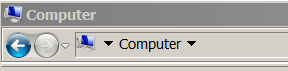
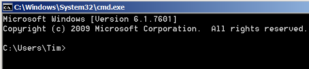
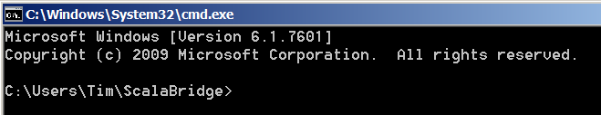

# Windows Setup
The workshop requires the following:
1. Use of a `shell`, the `Command Prompt` will do,
2. Java JDK (Java Development Kit) installed,
3. Scala installed, and
4. A text editor.

## Windows Shell
1. Press the `Windows` key and the `E` key together to open a Windows Explorer window with `Computer` selected.
2. Right click on `Computer` and select `Properties` from the context menu. This opens the System Control Panel window. Find the `System type:` field and note whether your computer is running 64-bit or 32-bit Windows.
3. Close the System Control Panel window.
4. Return to the Windows Explorer window. It should show `Computer` in the Address Bar toward the top of the window:



5. Left click to the left of Computer in the address bar and type: `\Users\<your user name>` and hit `Enter`. The window now displays the contents of your `Home` directory
6. Left click to the right of your user name in the address bar and type: `cmd` and hit `Enter`. This will open a Command Prompt window with your Home directory as the current working directory:



7. At the command prompt type: `mkdir ScalaBridge`
8. At the command prompt type: `cd ScalaBridge`

```
C:\Users\Tim>mkdir ScalaBridge

C:\Users\Tim>cd ScalaBridge

C:\Users\Tim\ScalaBridge>
```

You have now created a working directory for your workshop files. Type `exit` at the command prompt to close the window. Now use Windows Explorer to select your newly created working directory, then start a command shell in that directory. You should now have a command prompt window open showing your ScalaBridge directory as the current directory:



Now type: `java -version` at the prompt. If you have Java installed you should get a response like:

```
C:\Users\Tim\ScalaBridge>java -version
java version "1.8.0_101"
Java(TM) SE Runtime Environment (build 1.8.0_101-b13)
Java HotSpot(TM) 64-Bit Server VM (build 25.101-b13, mixed mode)

C:\Users\Tim\ScalaBridge>
```

If your Java version is 1.6 or higher, then you can skip the Java JDK Installation section below.

## Java JDK Installation
1. Download the JDK installer for Windows from [Oracle](http://www.oracle.com/technetwork/java/javase/downloads/index.html). If your computer is running 32-bit Windows download the `x86` version, if it is running 64-bit Windows download the `x64` version.
2. Run the installer
3. Add the `bin\` directory of the installed JDK to the PATH environment variable, as described [here](http://www.java.com/en/download/help/path.xml)
4. To verify the JDK installation, open the Command Prompt and type `java -version`:

```
C:\Users\Tim\dev\scala\curriculum>java -version
java version "1.8.0_91"
Java(TM) SE Runtime Environment (build 1.8.0_91-b60)
Java HotSpot(TM) 64-Bit Server VM (build 25.91-b60, mixed mode)
```

If you have problems installing the JDK, ask for help.

## Install Scala
1. Go to the [Scala Download page](http://www.scala-lang.org/download/) and choose the first option to download the Scala binaries installation package to your computer. The `download` button will automatically download the Windows installer for  Scala version 2.11.8.
2. Use Windows Explorer to locate and run the installer. The Scala Programming Language Distribution Setup Wizard will appear.
3. Repeatedly use the `Next` button to choose all the installation defaults. Check the box on the license page to accept the license.

The installer will install the core Scala language, update the System path for the Scala executables, and privide a start menu link to Scala documentation.

Verify installation by opening a command prompt window and entering `scala` at the prompt:

```
C:\Users\Tim>scala                                                         
Welcome to Scala 2.11.8 (Java HotSpot(TM) 64-Bit Server VM, Java 1.8.0_74).
Type in expressions for evaluation. Or try :help.                          
                                                                           
scala>        
```

The `scala>` prompt indicates you are in the Scala interpreter **R**ead-**E**valuate-**P**rint **L**oop or REPL. For now, just type `:quit` at the prompt to exit the REPL.
                                                             

## Install Doodle

[Download the ZIP file here](https://github.com/scalabridge/curriculum/raw/master/doodle.zip). Unzip the project and from the command line make sure you can do the following (this will take a little while the first time you do it).

```
$ ./sbt.sh
Getting org.scala-sbt sbt 0.13.7 ...
.
.
.
doodle-develop> console
.
.
.
scala> Circle(10)
res0: doodle.core.Circle = Circle(10.0)
```
